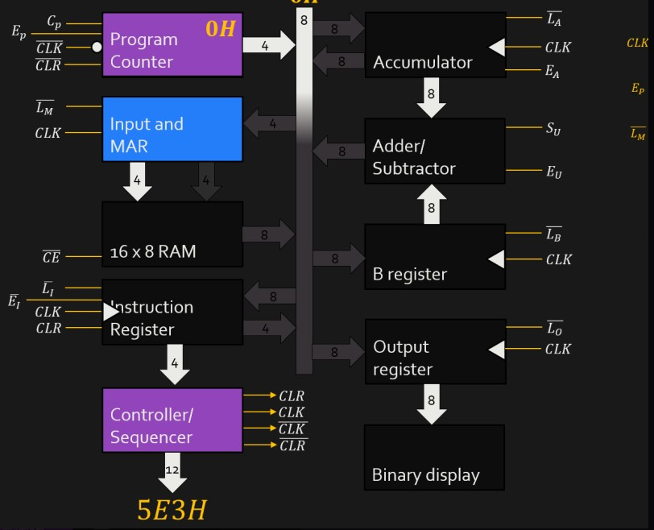

# SAP 1-Architecture
 SAP 1 is a basic model of microprocessor that contains basic functions such as addition and subtraction

# Implementation
 For the design implementation of SAP 1 architecture, it follows the design architecture presented in the image below and uses [digital](https://github.com/hneemann/Digital) simulator. 
 
 
 
 # Design 
 To open the complete simulation of SAP 1 architecture follow the steps below:
 ## Step 1
Open the [digital](https://github.com/hneemann/Digital) simulator.
## Step 2
Open the file SA1-P Architecture.dig located in SAP 1-Architecture folder

# Contact
Email: meccamaeumapas@gmail.com
